  

 

  
  
  
  

 

---

### Sobre Mim

Profissional com mais de 3 anos de experiencia em **Inteligencia Artificial**, **Engenharia de Dados** e **Desenvolvimento Backend**. Historico comprovado na construcao de pipelines de dados robustos (ETL/ELT), automacoes de processos e integracoes complexas com APIs REST. Especialista em orquestracao de workflows com Apache Airflow, n8n e Airbyte, alem de desenvolvimento de solucoes conversacionais com Blip, Typebot e Chatwoot. Solida experiencia em Machine Learning e IA Generativa com PyTorch e Scikit-Learn, aplicados a analise preditiva e mineracao de dados. Conhecimento em infraestrutura DevOps com Docker, Kubernetes e AWS.

 

  
    
  

 

---

### Inteligencia Artificial & Machine Learning

  
  
  
  
  
  

### Engenharia de Dados & ETL

  
  
  
  

### Desenvolvimento Backend & APIs

  
  
  
  

### Chatbots & Automacao

  
  
  
  

### Bancos de Dados

  
  
  
  

### DevOps & Cloud

  
  
  
  
  
  

### Visualizacao de Dados

  
  

 

---

### Projetos em Destaque

 

  <table>
    <tr>
      <td width="50%" align="center">
        <b>ECOdata</b> 
        Integracao Tradefy — geracao de arquivos de estoque, sellout e painel com envio SFTP e dashboard
          
        
      </td>
      <td width="50%" align="center">
        <b>DocIntellect</b> 
        RPA com OCR + NLP para extracao e classificacao de dados de documentos
          
        
      </td>
    </tr>
    <tr>
      <td width="50%" align="center">
        <b>ECOnnect</b> 
        Plataforma para gerenciar, testar e monitorar integracoes entre sistemas ECO e APIs externas
          
        
      </td>
      <td width="50%" align="center">
        <b>ECOFlow</b> 
        Monitoramento e sincronizacao de solicitacoes via web scraping com kanban e dashboard
          
        
      </td>
    </tr>
  </table>

 

---

<h3 align="center">Vamos Conectar?</h3>

  
  
  

 

  <em>"Transformando dados em decisoes inteligentes"</em>

 

  

 

  

